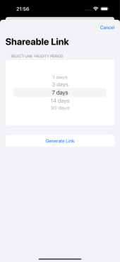

# SymptomSaga – Heart Palpitation Tracking App

**SymptomSaga** is an iOS app built in **Swift** using the **[Spezi framework](https://github.com/StanfordSpezi/Spezi)**.  
The app helps patients capture and contextualize **episodic heart palpitations** by combining:  
- **ECG and health data** from wearables (via Apple HealthKit)  
- **Symptom reporting** through a guided questionnaire  
- **Secure, shareable health reports** for clinicians  

This project was developed as part of the course [TRA460: Digital Health Implementation](https://www.chalmers.se/en/education/your-studies/course-selection-and-registration/select-courses/choose-a-tracks-course/digital-health-implementation/) at Chalmers University of Technology.

## Features

- **Health Data Integration**  
  - Fetches ECG, heart rate, resting heart rate, and heart rate variability from **Apple HealthKit**  
  - Supports real-time visualization of wearable data  

- **Symptom Tracking**  
  - Patients log palpitations, severity, duration, and potential triggers  
  - Data is timestamped and linked with corresponding health metrics  

- **FHIR Backend Support**  
  - All health data and symptom logs are converted into **FHIR resources**  
  - Data can be pushed to a **FHIR server** (HAPI FHIR or Meld Sandbox)  

- **Shareable Reports**  
  - Patients can generate a secure, time-limited web link to share compiled health reports  
  - Reports include vitals, ECG traces, and symptom insights  

- **User-Friendly Interface**  
  - Simple onboarding process with consent handling  
  - Dashboard showing most recent vitals and past logs  
  - Settings for digital prescriptions via external apps (e.g., Fibricheck integration)  

---


## Tech Stack

- **iOS App**: Swift + [Spezi Framework](https://github.com/StanfordSpezi/Spezi)  
- **Health Data**: Apple HealthKit  
- **Backend**: HAPI FHIR Server / Meld Sandbox (via Docker)  
- **Web Report (separate repo)**: [HeartPalp-Dashboard](https://github.com/tyrawallen/HeartPalp-Dashboard) (Next.js)  

---

### Setup
1. Clone the repository:  
   ```bash
   git clone https://github.com/dpediaditis/heart_palpitation.git
   cd heart_palpitation

---

## Data Flow

1. Patient initiates measurement in the app.
2. App retrieves ECG and vitals (heart rate, HRV, etc.) from HealthKit.
3. Patient logs symptoms (severity, activity, duration).
4. Data is bundled into FHIR resources and sent to the backend.
5. Patient can generate a secure link to a structured web report.

---

## Screenshots
### Dashboard
<p align="center">
  
  
  
</p>

<p align="center"><i>Main app screen showing ECG recording and vitals from Apple Health.</i></p>

---

### Heart Palpitation
<p align="center">
  
  
  
  
  
  
</p>

<p align="center"><i>Patient flow to start recording a palpitation episode.</i></p>

---

### Logs

<p align="center">
  
  
</p>

<p align="center"><i>Log view.</i></p>

---

### Disclaimer

This app is a prototype and not a certified medical device.
It is intended for research and educational purposes only and should not be used for clinical decision-making.
